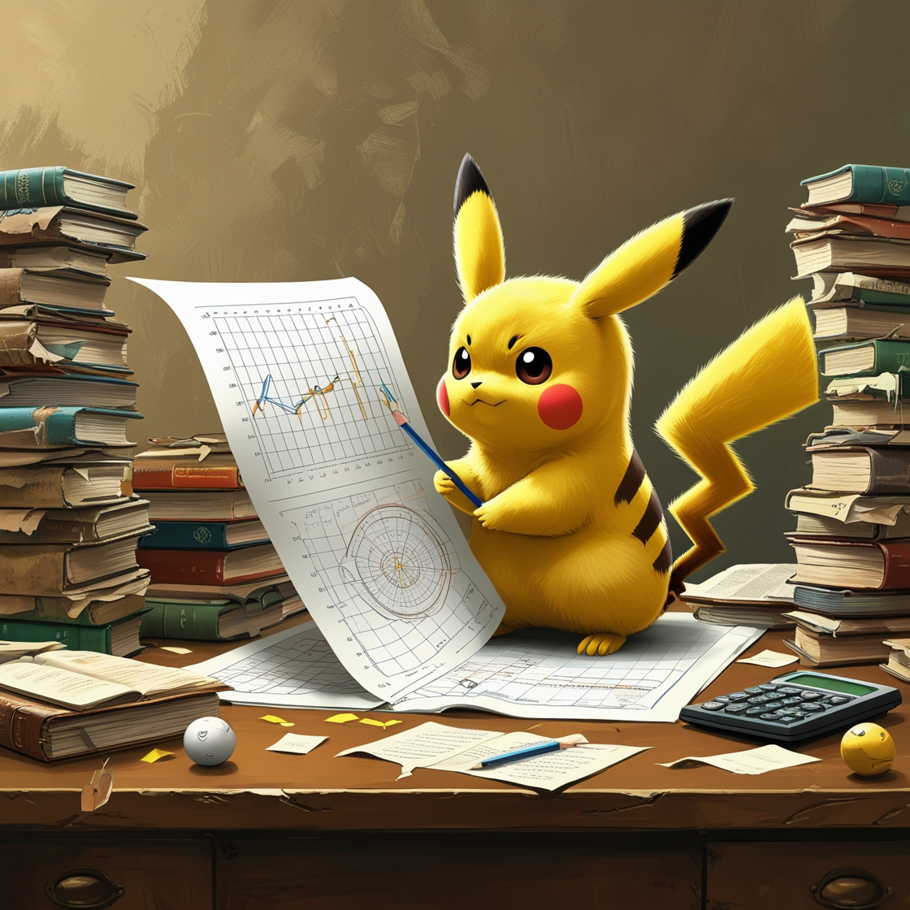

```{r}
# CORE PKG'S
library(tidyverse)
library(corrplot)
library(RColorBrewer)
library(reshape2)

# carregando o dataset
dt <- read.csv("data/Pokemon.csv")
```

# Introdução

## Pokémon!

::::: columns
::: {.column width="55%"}
-   Pokémon é um dos animes mais icônicos e bem-sucedidos de todos os tempos. Estreou no Japão em 1º de abril de 1997.

-   A primeira geração de Pokémons consistia em 151 criaturas, e em 2025, já estamos na nona geração, com um total de 1025 Pokémons.

-   Nossa tabela de dados contém 721 Pokémons, abrangendo desde a primeira até a sexta geração.

-   O Objetivo do trabalho é identificar correlações entre as variáveis que existem na tabela de dados.
:::

::: {.column width="45%"}
{.absolute width="400" height="400" style="border-radius: 20px;"}
:::
:::::

## Variáveis Categóricas


## Variáveis Contínuas

```{r bibliotecas e dt, include=FALSE}
library(GGally)
library(tidyverse)
library(corrplot)
library(reshape2)
library(viridisLite)
library(viridis)
library(RColorBrewer)

dt <- read.csv("data/Pokemon.csv")
```
## Correlação gráfico de dispersão
```{r dispersão, warning=FALSE, message=FALSE}

dt_sem_name <- dt %>% select(HP, Attack, Defense, Sp..Atk, Sp..Def, Speed)

ggpairs(
  dt_sem_name,
  axisLabels = "none" # Remove os rótulos dos eixos
) +
  theme(
    panel.background = element_rect(fill = "white"), 
    plot.background = element_rect(fill = "white")
  )
```

## Correlação gráfico heatmap

```{r heatmap,warning=FALSE, message=FALSE}

var_num <- c("HP", "Attack", "Defense", "Sp..Atk", "Sp..Def", "Speed")

cor_matrix <- cor(dt[var_num], use = "complete.obs")

paleta <- colorRampPalette(brewer.pal(9, "Blues"))

cor_df <- melt(cor_matrix, value.name = "correlation")

cor_df_upper <- cor_df %>%
  filter(as.integer(Var1) <= as.integer(Var2))


ggplot(cor_df_upper, aes(x = Var2, y = Var1, fill = correlation)) +
  geom_tile(color = "white") +
  geom_text(aes(label = sprintf("%.2f", correlation),
                color = ifelse(abs(correlation) < 0.5, "white", "white")), 
            size = 3.5) +
  scale_fill_gradientn(
    colors = paleta(100), 
    limits = c(-1, 1),
    breaks = seq(-1, 1, by = 0.2),
    name = NULL  
  ) +
  scale_color_identity() +
  scale_y_discrete(limits = rev(levels(cor_df$Var1)), position = "left") +  
  scale_x_discrete(position = "top") +  
  labs(
    title = "Correlação entre Estatísticas de Pokémon",
    x = NULL,
    y = NULL
  ) +
  theme_minimal() +
  theme(
    axis.text = element_text(color = "#01080f", size = 10),
    axis.text.y = element_text(hjust = 1, margin = margin(r = 0, l = 0)),
    axis.text.x = element_text(vjust = 0, margin = margin(b = 0)),
    plot.title = element_text(hjust = 0, face = "bold", size = 14),
    panel.grid.major = element_blank(),
    panel.grid.minor = element_blank(),
    legend.title = element_text(size = 10),
    legend.position = "right",
    legend.key.height = unit(2, "cm"), 
    legend.key.width = unit(0.8, "cm"),  
    plot.margin = margin(t = 20, r = 10, b = 10, l = 0),  
    panel.spacing = unit(0, "lines")
  ) +
  coord_fixed(ratio = 1)

```
