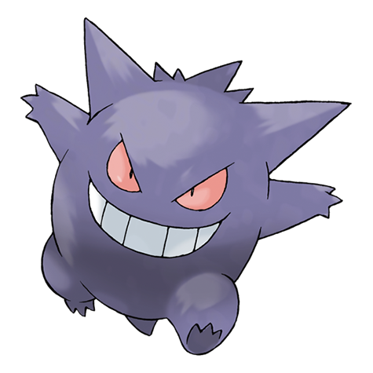
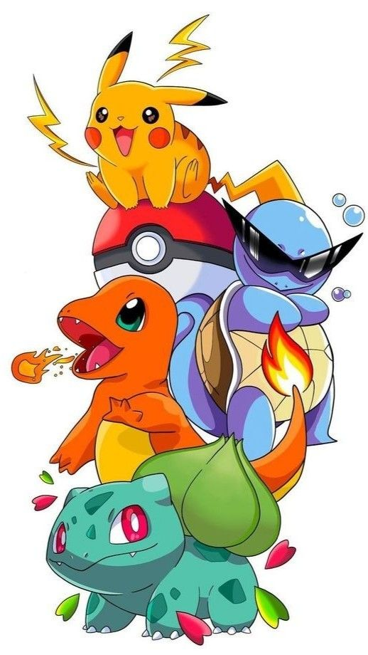
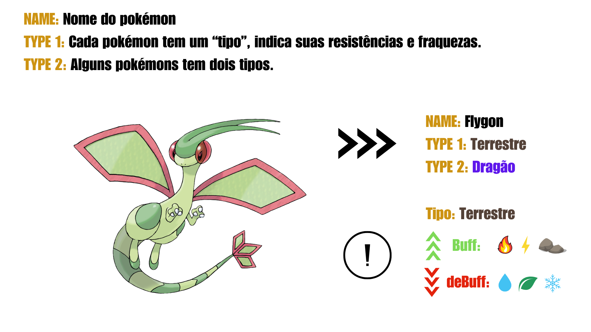
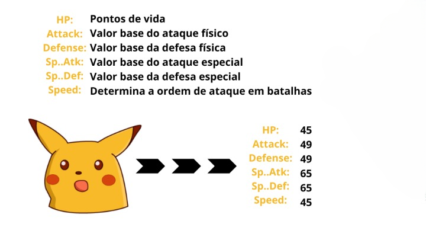

```{r libs, include = FALSE}
packages <- c("GGally", "tidyverse", "corrplot", "reshape2", "viridisLite",
              "viridis", "RColorBrewer", "igraph", "ggraph", "plotly", "ggExtra", "reticulate")

for (p in packages) {
  if (!require(p, character.only = TRUE)) install.packages(p)
  library(p, character.only = TRUE)
}
```

```{r data, include = FALSE}
dt <- read.csv("data/Pokemon.csv")
```

# Introdução



## Pokémon!

::::: columns
::: {.column width="55%"}
 - Pokémon é um dos animes mais icônicos e bem-sucedidos de todos os tempos. Estreou no Japão em 1º de abril de 1997.

 - A primeira geração de Pokémons consistia em 151 criaturas, e em 2025, já estamos na nona geração, com um total de 1025 Pokémons.

 - Nossa tabela de dados contém 721 Pokémons, abrangendo desde a primeira até a sexta geração.
:::
::: {.column width="45%"}
{.absolute style="border-radius: 40px;"}
:::
:::::

## Variáveis Categóricas


## Variáveis Quantitativas


# Gráficos

## Correlação gráfico de dispersão
```{r dispersão, warning=FALSE, message=FALSE}

dt_sem_name <- dt %>% select(HP, Attack, Defense, Sp..Atk, Sp..Def, Speed)

ggpairs(
  dt_sem_name,
  axisLabels = "none"
) +
  theme(
    panel.background = element_rect(fill = "white"),
    plot.background = element_rect(fill = "white")
  )
```

## Correlação gráfico heatmap

```{r heatmap,warning=FALSE, message=FALSE}

var_num      <- c("HP", "Attack", "Defense", "Sp..Atk", "Sp..Def", "Speed")
cor_matrix   <- cor(dt[var_num], use = "complete.obs")
paleta       <- colorRampPalette(brewer.pal(9, "Blues"))
cor_df       <- melt(cor_matrix, value.name = "correlation")
cor_df_upper <- cor_df %>%
  filter(as.integer(Var1) <= as.integer(Var2))

ggplot(cor_df_upper, aes(x = Var2, y = Var1, fill = correlation)) +
  geom_tile(color = "white") +
  geom_text(aes(label = sprintf("%.2f", correlation),
                color = ifelse(abs(correlation) < 0.5, "white", "white")),
            size = 3.5) +
  scale_fill_gradientn(
    colors = paleta(100),
    limits = c(-1, 1),
    breaks = seq(-1, 1, by = 0.2),
    name = NULL
  ) +
  scale_color_identity() +
  scale_y_discrete(limits = rev(levels(cor_df$Var1)), position = "left") +
  scale_x_discrete(position = "top") +
  labs(
    title = "Correlação entre Estatísticas de Pokémon",
    x = NULL,
    y = NULL
  ) +
  theme_minimal() +
  theme(
    axis.text = element_text(color = "#01080f", size = 10),
    axis.text.y = element_text(hjust = 1, margin = margin(r = 0, l = 0)),
    axis.text.x = element_text(vjust = 0, margin = margin(b = 0)),
    plot.title = element_text(hjust = 0, face = "bold", size = 14),
    panel.grid.major = element_blank(),
    panel.grid.minor = element_blank(),
    legend.title = element_text(size = 10),
    legend.position = "right",
    legend.key.height = unit(2, "cm"),
    legend.key.width = unit(0.8, "cm"),
    plot.margin = margin(t = 20, r = 10, b = 10, l = 0),
    panel.spacing = unit(0, "lines")
  ) +
  coord_fixed(ratio = 1)
```

## Relação entre tipo, subtipo e geração

```{r graph,warning=FALSE, message=FALSE}
pikomon = dt %>%
  filter(dt$Type.2 != "")

edges = pikomon %>%
  filter(!is.na(`Type.2`)) %>%
  group_by(`Type.1`, `Type.2`) %>%
  summarise(
    n = n(),
    Generation = names(which.max(table(Generation)))
  ) %>%
  filter(n >= 5)

graph = graph_from_data_frame(edges, directed = FALSE)

cores_geracoes = c(
  "1" = "#00A6ED", "2" = "#FF007F", "3" = "#FFD700",
  "4" = "#00FF00", "5" = "#8000FF", "6" = "#FF4500"
)

ggraph(graph, layout = "kk") +
  geom_edge_link(aes(width = n, color = Generation), alpha = 0.5,show.legend = FALSE) +
  geom_edge_link(aes(color = Generation), alpha = 0.5) +
  geom_node_point(aes(size = degree(graph), color = "#CFD8DC"), alpha = 0.9,show.legend = FALSE) +
  geom_node_text(aes(label = name), size = 4, repel = TRUE) +
  scale_edge_color_manual(values = cores_geracoes) +
  scale_color_identity() +
  theme_void()
```

## Lendários e não lendários
```{r scatter}

fig <- plot_ly(data = dt,
                  x = ~Defense,
                  y = ~Attack,
             symbol = ~Legendary,
            symbols = c('circle','x'),
               text = ~paste(Name))

fig <- fig %>% layout(showlegend = FALSE)
fig
```


```{r}
library(treemap)
# library(d3treeR)

# basic treemap
p <- treemap(dt,
            index=c("Type.1"),
            vSize="Total",
            type="index",
            palette = "Set2",
            bg.labels=c("white"),
            align.labels=list(
              c("center", "center"),
              c("right", "bottom")
            )
          )

p
```
