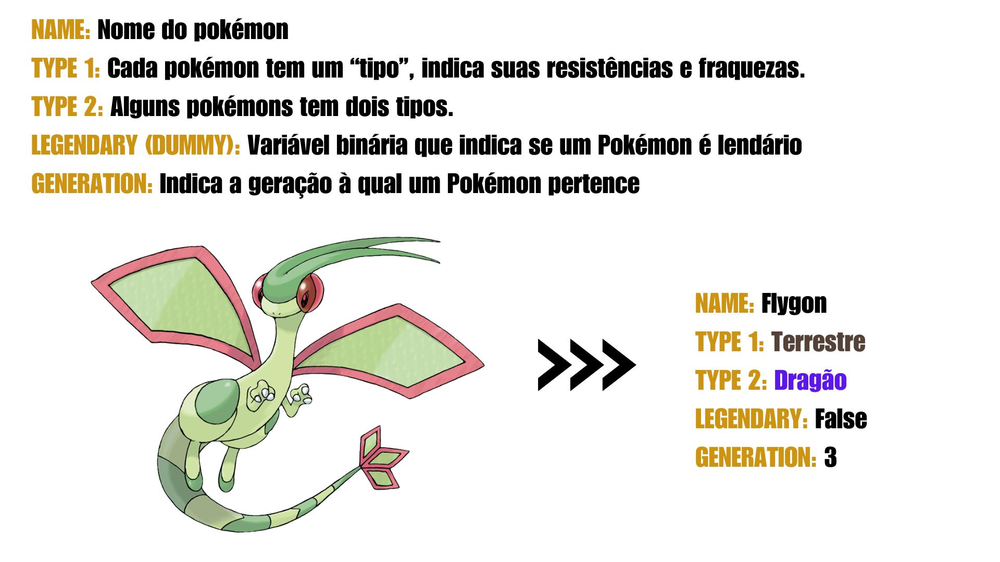

```{r libs, include = FALSE}
packages <- c("GGally", "tidyverse", "corrplot", "reshape2", "viridisLite",
              "viridis", "RColorBrewer", "igraph", "ggraph", "plotly", "ggExtra", "reticulate", "hrbrthemes", "ggiraph", "dplyr", "ellipse", "fmsb", "scales")

for (p in packages) {
  if (!require(p, character.only = TRUE)) install.packages(p)
  library(p, character.only = TRUE)
}
```

```{r data, include = FALSE}
dt <- read.csv("data/Pokemon.csv")
```

# Introdução


## Pokémon!

::::: columns
::: {.column width="55%"}
 - Pokémon é um dos animes mais icônicos e bem-sucedidos de todos os tempos. Estreou no Japão em 1º de abril de 1997.

 - A primeira geração de Pokémons consistia em 151 criaturas, e em 2025, já estamos na nona geração, com um total de 1025 Pokémons.

 - Nossa tabela de dados contém 721 Pokémons, abrangendo desde a primeira até a sexta geração.
:::
::: {.column width="45%"}
{.absolute top=0 style="border-radius: 40px;"}
:::
:::::

## Variáveis Categóricas


## Variáveis Quantitativas


# Gráficos

## Correlação gráfico heatmap

```{r heatmap,warning=FALSE, message=FALSE}

var_num      <- c("HP", "Attack", "Defense", "Sp..Atk", "Sp..Def", "Speed")
cor_matrix   <- cor(dt[var_num], use = "complete.obs")
paleta       <- colorRampPalette(brewer.pal(9, "Blues"))
cor_df       <- melt(cor_matrix, value.name = "correlation")
cor_df_upper <- cor_df %>%
  filter(as.integer(Var1) <= as.integer(Var2))

ggplot(cor_df_upper, aes(x = Var2, y = Var1, fill = correlation)) +
  geom_tile(color = "white") +
  geom_text(aes(label = sprintf("%.2f", correlation),
                color = ifelse(abs(correlation) < 0.5, "white", "white")),
            size = 3.5) +
  scale_fill_gradientn(
    colors = paleta(100),
    limits = c(-1, 1),
    breaks = seq(-1, 1, by = 0.2),
    name = NULL
  ) +
  scale_color_identity() +
  scale_y_discrete(limits = rev(levels(cor_df$Var1)), position = "left") +
  scale_x_discrete(position = "top") +
  labs(
    title = "Correlação entre Estatísticas de Pokémon",
    x = NULL,
    y = NULL
  ) +
  theme_minimal() +
  theme(
    axis.text = element_text(color = "#01080f", size = 10),
    axis.text.y = element_text(hjust = 1, margin = margin(r = 0, l = 0)),
    axis.text.x = element_text(vjust = 0, margin = margin(b = 0)),
    plot.title = element_text(hjust = 0, face = "bold", size = 14),
    panel.grid.major = element_blank(),
    panel.grid.minor = element_blank(),
    legend.title = element_text(size = 10),
    legend.position = "right",
    legend.key.height = unit(2, "cm"),
    legend.key.width = unit(0.8, "cm"),
    plot.margin = margin(t = 20, r = 10, b = 10, l = 0),
    panel.spacing = unit(0, "lines")
  ) +
  coord_fixed(ratio = 1)
```

## Correlograma

```{r dispersão, warning=FALSE, message=FALSE}

dt_sem_name <- dt %>% select(HP, Attack, Defense, Sp..Atk, Sp..Def, Speed)


wine.corr <- cor(dt_sem_name)
ord <- order(wine.corr[1,])
xc <- wine.corr[ord, ord]
plotcorr(xc, col=cm.colors(11)[5*xc + 6])
```

## Relação entre tipo, subtipo e geração

```{r graph,warning=FALSE, message=FALSE}
pikomon = dt %>%
  filter(dt$Type.2 != "")

edges = pikomon %>%
  filter(!is.na(`Type.2`)) %>%
  group_by(`Type.1`, `Type.2`) %>%
  summarise(
    n = n(),
    Generation = names(which.max(table(Generation)))
  ) %>%
  filter(n >= 5)

graph = graph_from_data_frame(edges, directed = FALSE)

cores_geracoes = c(
  "1" = "#00A6ED", "2" = "#FF007F", "3" = "#FFD700",
  "4" = "#00FF00", "5" = "#8000FF", "6" = "#FF4500"
)

ggraph(graph, layout = "kk") +
  geom_edge_link(aes(width = n, color = Generation), alpha = 0.5,show.legend = FALSE) +
  geom_edge_link(aes(color = Generation), alpha = 0.5) +
  geom_node_point(aes(size = degree(graph), color = "#CFD8DC"), alpha = 0.9,show.legend = FALSE) +
  geom_node_text(aes(label = name), size = 4, repel = TRUE) +
  scale_edge_color_manual(values = cores_geracoes) +
  scale_color_identity() +
  theme_void()
```

## Lendários e não lendários
```{r scatterplot, echo = FALSE, Warning = FALSE}

main_plot <- dt %>%
  plot_ly(
    x = ~Defense,
    y = ~Attack,
    color = ~Legendary,
    colors = c("#1f77b4", "#ff7f0e"),
    type = "scatter",
    mode = "markers",
    symbol    = ~Legendary,
    symbols   = c('circle', 'x'),
    hoverinfo = "text",
    text = ~paste("Name:", Name, "<br>Attack:", Attack, "<br>Defense:", Defense),
    showlegend = FALSE
  )

density_x <- dt %>%
  plot_ly(
    x = ~Defense,
    color = ~Legendary,
    colors = c("#1f77b4", "#ff7f0e"),
    type = "box",
    showlegend = FALSE
  ) %>%
 layout(
   xaxis = list(
                # showline = FALSE,
                # showticklabels = FALSE,
                showgrid = FALSE,
                zeroline = TRUE),
   yaxis = list(
                # showline = FALSE,
                # showticklabels = FALSE,
                showgrid = FALSE,
                zeroline = TRUE)
 )

density_y <- dt %>%
  plot_ly(
    y = ~Attack,
    color = ~Legendary,
    colors = c("#1f77b4", "#ff7f0e"),
    type = "box",
    showlegend = FALSE
    ) %>%
  layout(
      xaxis = list(
                   # showline = FALSE,
                   # showticklabels = FALSE,
                   showgrid = FALSE,
                   zeroline = TRUE),
      yaxis = list(
                   # showline = FALSE,
                   # showticklabels = FALSE,
                   showgrid = FALSE,
                   zeroline = TRUE)
    )

final_plot <- subplot(
  density_x,
  plotly_empty(),
  main_plot,
  density_y,
  nrows = 2,
  widths = c(0.85, 0.15),
  heights = c(0.15, 0.85),
  margin = 0.01,
  shareX = TRUE,
  titleX = TRUE,
  shareY = TRUE,
  titleY = TRUE
)

final_plot <- final_plot %>%
  config(responsive = TRUE)

final_plot
```

## Atributos por tipos
```{r, echo = FALSE, Warning = FALSE}

tipos_selecionados <- c("Dragon", "Flying", "Steel")
dados_tipos <- dt %>%
  filter(Type.1 %in% tipos_selecionados) %>%
  group_by(Type.1) %>%
  summarise(across(c(HP, Attack, Defense, Sp..Atk, Sp..Def, Speed), mean)) %>%
  rename(Type = Type.1)

dados_normalizados <- dados_tipos %>%
  mutate(across(-Type, ~ rescale(.x, to = c(10, 110)))) %>%
  select(-Type) %>%
  as.data.frame()

dados_plot <- rbind(
  rep(120, 6) %>% setNames(names(dados_normalizados)),
  rep(10, 6) %>% setNames(names(dados_normalizados)),
  dados_normalizados
)

type_colors <- c(
  "Dragon" = rgb(106, 13, 173, max = 255, alpha = 180),
  "Flying" = rgb(135, 206, 235, max = 255, alpha = 180),
  "Steel" = rgb(192, 192, 192, max = 255, alpha = 180)
)

radarchart(
  dados_plot,
  axistype = 1,
  pcol = substr(type_colors, 1, 7),
  pfcol = type_colors,
  plwd = 3,
  plty = 1,
  cglcol = "gray50",
  cglty = 1,
  cglwd = 1,
  axislabcol = "gray20",
  vlcex = 1,  # Rótulos aumentados
  seg = 5,
  centerzero = FALSE,
  cex.main = 1.25
)
```